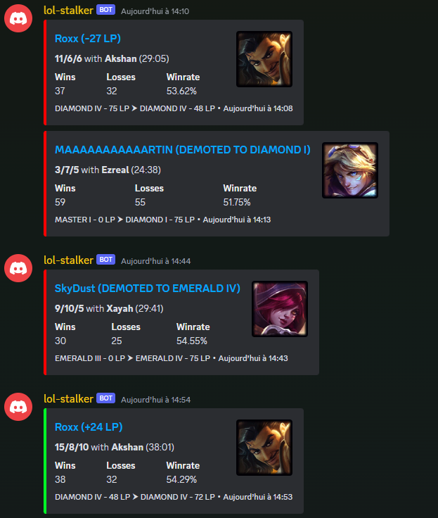
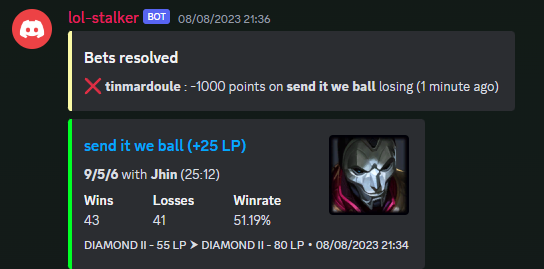
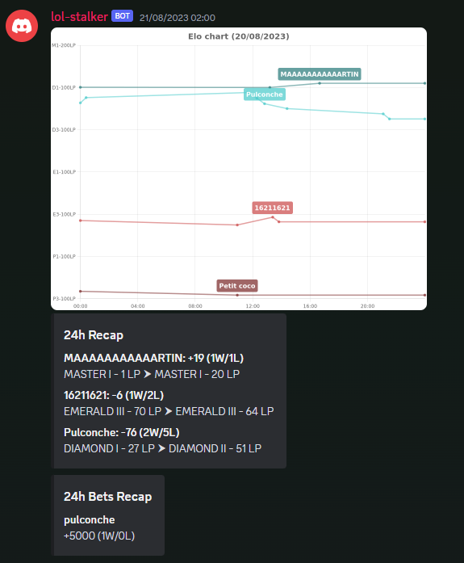
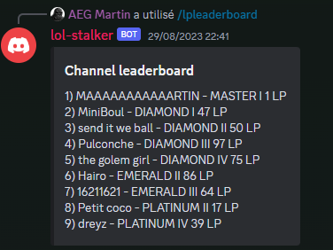

League of Legends LP tracking Discord bot

# Features

## Game and LP logging



## Bet on games



## Daily recaps with chart



## Discord leaderboard



# Available commands

```
/addsummoner NAME
/removesummoner NAME
/listsummoners

/bet POINTS NAME WIN
/listbets
/mybets

/lpleaderboard
/pointsleaderboard
```

# Local development

`pnpm install`

## Bot

-   Create an applications on Discord developer portal ([https://discord.com/developers/applications](https://discord.com/developers/applications))
-   Copy `.env.dist` to `.env` and fill it with your variables, you can find BOT_TOKEN into the "Bot" section on the previously created Discord app
-   `docker compose up -d`
-   `pnpm core dev`

## Templates

-   `pnpm templates dev`

### Create a template

Create a new file `packages/templates/YourTemplate.tsx`, it should start with

```tsx
    import { setContext, type DefaultProps } from './utils';

    export const MatchDetails = (props: DefaultProps) => {
        setContext(props);

        const { match, participant } = props;
```

Once your template is created, you have to :

-   register its dimensions in `packages/core/src/features/details/templates.tsx` in the `dimensions` variable
-   register its command name in `packages/core/src/commands/buttons.ts`
-   edit the `getComponentsRow` function to add the button to discord messages in `packages/core/src/features/lol/elo.ts`
